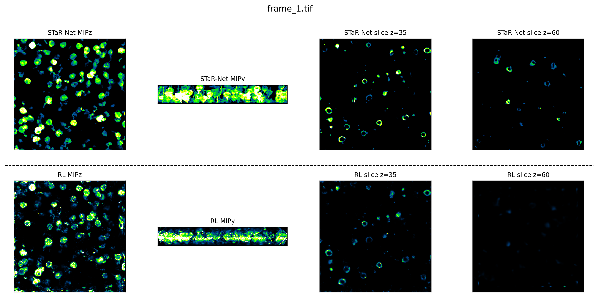

# STaR-Net

Official implementation of **STaR-Net** for sparse-view time-lapse 2pSAM volumetric reconstruction.

STaR-Net performs multi-frame input and parallel multi-frame output reconstruction, supporting training, demo inference, Richardson-Lucy (RL) baseline reconstruction, visualization, and fixed-shape TensorRT deployment.

## Review Release

This repository is prepared as a compact code-and-demo release for manuscript review.

| Included in GitHub | Provided by download link |
| --- | --- |
| Core source code | Full BioDiverse4D training dataset |
| Demo input sequence | Full PSF files for RL reconstruction |
| One released STaR-Net checkpoint | Large experiment outputs |
| Environment files and README | Additional benchmark data |

## Contents

- [Repository Structure](#repository-structure)
- [Installation](#installation)
- [Demo Inference](#demo-inference)
- [Richardson-Lucy Baseline](#richardson-lucy-baseline)
- [Visualization Comparison](#visualization-comparison)
- [Training](#training)
- [TensorRT Deployment](#tensorrt-deployment)
- [Data and Pretrained Weights](#data-and-pretrained-weights)
- [Citation](#citation)
- [Acknowledgments](#acknowledgments)

## Repository Structure

```text
.
├── BioDiverse4D/           # Download note for the full training dataset
├── code/                   # Core implementation
│   ├── configs/            # YAML configuration files
│   ├── datasets/           # Dataset loaders and wrappers
│   ├── models/             # STaR-Net model definitions
│   ├── pretrained_weights/ # LPIPS/perceptual-loss weights
│   ├── RL/                 # MATLAB Richardson-Lucy baseline
│   ├── tensorrt/           # ONNX/TensorRT conversion utility
│   ├── train.py            # Training entry point
│   ├── test.py             # Inference entry point
│   ├── bash_train.sh       # Example training launcher
│   └── bash_test.sh        # Example inference launcher
├── demo_data/              # Small demo sequence
├── psf/                    # Download note for PSF files
├── save/                   # Released demo checkpoint
├── environment.yml         # Conda environment template
├── requirements.txt        # Pip dependency list
└── README.md
```

## Installation

Due to the poor stability of Mamba CUDA extensions in native Windows environments, the following installation instructions assume a Linux system. Native Windows is not supported. The tested Mamba wheels are Linux x86_64 wheels.

The tested machine reports CUDA 12.0 in `nvidia-smi`, while the working PyTorch runtime uses CUDA 11.8 wheels for compatibility.

### 1. Create a Conda Environment

```bash
conda create -n starnet python=3.10 -y
conda activate starnet

python -m pip install --upgrade pip setuptools wheel
```

### 2. Check CUDA and GPU Information

```bash
nvidia-smi
nvcc --version
uname -m
```

Check the CUDA version reported by `nvidia-smi`. For example:

```text
CUDA Version: 12.0
```

This indicates the maximum CUDA runtime supported by the NVIDIA driver. In this tested setup, PyTorch CUDA 11.8 wheels are used for compatibility.

### 3. Install PyTorch

Install PyTorch 2.5.0 with CUDA 11.8 wheels:

```bash
python -m pip install torch==2.5.0 torchvision==0.20.0 torchaudio==2.5.0 \
  --index-url https://download.pytorch.org/whl/cu118
```

Verify the PyTorch installation:

```bash
python - <<'PY'
import torch

print("torch:", torch.__version__)
print("torch cuda:", torch.version.cuda)
print("cuda available:", torch.cuda.is_available())
print("gpu:", torch.cuda.get_device_name(0) if torch.cuda.is_available() else "None")
print("cxx11 abi:", torch._C._GLIBCXX_USE_CXX11_ABI)
PY
```

Expected output should be similar to:

```text
torch: 2.5.0+cu118
torch cuda: 11.8
cuda available: True
gpu: NVIDIA A100-SXM4-40GB
cxx11 abi: False
```

### 4. Install Common Requirements

From the project root directory:

```bash
python -m pip install -r requirements.txt
```

If `requirements.txt` does not pin exact package versions, pip may install a newer `transformers` version. If `mamba_ssm==2.2.4` later reports a `transformers` import error while installing or verifying the Mamba wheels, use the downgrade commands in the Mamba wheel installation section.

### 5. Choose Compatible Mamba Wheels

The PyTorch, `causal_conv1d`, and `mamba_ssm` builds must match each other. A mismatched CUDA or PyTorch wheel may install successfully but fail at runtime with errors such as `undefined symbol`, `ImportError`, or `cannot import selective_scan_cuda`.

Before downloading Mamba-related wheels, check the active environment:

```bash
python - <<'PY'
import platform
import sys
import torch

print("python:", sys.version)
print("platform:", platform.machine())
print("torch:", torch.__version__)
print("torch cuda:", torch.version.cuda)
print("cxx11 abi:", torch._C._GLIBCXX_USE_CXX11_ABI)
PY
```

Use these values to choose wheel filenames:

```text
torch 2.5.x + cu118  -> wheel tag: cu11torch2.5
Python 3.10          -> wheel tag: cp310
CXX11 ABI False      -> wheel tag: cxx11abiFALSE
Linux x86_64         -> wheel tag: linux_x86_64
```

The CUDA version shown by `nvidia-smi` does not need to be identical to `torch.version.cuda`. For example, a machine may report `CUDA Version: 12.0` in `nvidia-smi` while PyTorch reports `torch cuda: 11.8`. This is valid when the NVIDIA driver supports the PyTorch CUDA runtime. For Mamba wheels, match the wheel CUDA tag to the PyTorch CUDA runtime, not only to the `nvidia-smi` display.

For the tested environment:

```text
torch: 2.5.0+cu118
torch cuda: 11.8
cxx11 abi: False
platform: x86_64
```

use wheels similar to:

```text
causal_conv1d-...+cu11torch2.5cxx11abiFALSE-cp310-cp310-linux_x86_64.whl
mamba_ssm-...+cu11torch2.5cxx11abiFALSE-cp310-cp310-linux_x86_64.whl
```

Do not mix incompatible PyTorch and Mamba wheel builds. For example, do not use a `mamba_ssm` wheel built for `torch2.5` with `torch 2.7.1+cu118`, and do not use a `cu12torch2.5` Mamba wheel with `torch 2.5.0+cu118`.

### 6. Download and Install Mamba Wheels

Create a directory for local wheels:

```bash
mkdir -p wheels
```

Download wheels matching the current environment:

```bash
wget -c -P wheels "https://github.com/Dao-AILab/causal-conv1d/releases/download/v1.5.0.post8/causal_conv1d-1.5.0.post8+cu11torch2.5cxx11abiFALSE-cp310-cp310-linux_x86_64.whl"

wget -c -P wheels "https://github.com/state-spaces/mamba/releases/download/v2.2.4/mamba_ssm-2.2.4+cu11torch2.5cxx11abiFALSE-cp310-cp310-linux_x86_64.whl"
```

Install the wheels:

```bash
python -m pip install wheels/causal_conv1d-1.5.0.post8+cu11torch2.5cxx11abiFALSE-cp310-cp310-linux_x86_64.whl

python -m pip install wheels/mamba_ssm-2.2.4+cu11torch2.5cxx11abiFALSE-cp310-cp310-linux_x86_64.whl
```

If this step, or the verification step below, reports a `transformers` compatibility error such as:

```text
ImportError: cannot import name 'GreedySearchDecoderOnlyOutput'
```

downgrade `transformers` to a compatible version:

```bash
python -m pip uninstall -y transformers tokenizers huggingface-hub

python -m pip install "transformers==4.44.2" \
  "tokenizers>=0.19,<0.20" \
  "huggingface-hub>=0.23.2,<1.0"
```

Verify the installed versions:

```bash
python - <<'PY'
import transformers
import tokenizers
import huggingface_hub

print("transformers:", transformers.__version__)
print("tokenizers:", tokenizers.__version__)
print("huggingface-hub:", huggingface_hub.__version__)
PY
```

The expected `transformers` version is:

```text
transformers: 4.44.2
```

The downloaded wheel filenames must match the environment:

```text
cu11             compatible with PyTorch cu118 wheels
torch2.5         compatible with PyTorch 2.5.x
cp310            compatible with Python 3.10
cxx11abiFALSE    compatible with torch._C._GLIBCXX_USE_CXX11_ABI = False
linux_x86_64     compatible with Linux x86_64
```

### 7. Verify the Full Installation

```bash
python - <<'PY'
import torch
import transformers
import causal_conv1d
from mamba_ssm import Mamba2

print("torch:", torch.__version__)
print("torch cuda:", torch.version.cuda)
print("cuda available:", torch.cuda.is_available())
print("cxx11 abi:", torch._C._GLIBCXX_USE_CXX11_ABI)
print("transformers:", transformers.__version__)
print("causal_conv1d ok")
print("mamba_ssm Mamba2 ok")
PY
```

Expected output should include:

```text
torch: 2.5.0+cu118
torch cuda: 11.8
cuda available: True
cxx11 abi: False
transformers: 4.44.2
causal_conv1d ok
mamba_ssm Mamba2 ok
```

If this script finishes without errors, the PyTorch and Mamba environment is installed correctly.

### Tested Package Combination

```text
Linux x86_64
Python 3.10
torch 2.5.0+cu118
torchvision 0.20.0
torchaudio 2.5.0
causal-conv1d 1.5.0.post8 + cu11torch2.5 wheel
mamba-ssm 2.2.4 + cu11torch2.5 wheel
transformers 4.44.2
```

Do not mix incompatible PyTorch and Mamba wheel builds. For example, do not use a `mamba_ssm` wheel built for `torch2.5` with `torch 2.7.1+cu118`, and do not use a `cu12torch2.5` Mamba wheel with `torch 2.5.0+cu118`.

### Optional Dependencies

Install lower-priority analysis, ONNX, and deployment utilities only when needed:

```bash
python -m pip install -r requirements-optional.txt
```

TensorRT-related packages are optional and may be difficult to configure on some devices. They are only needed for accelerated inference on large-scale datasets. If you only want to run the demo with the PyTorch backend, you can skip TensorRT setup.

## Demo Inference

The workflow command blocks below assume you start from the project root directory. Blocks that need to enter `code/` use a subshell, so your terminal returns to the project root after the block finishes.

The demo uses:

- Input data: `demo_data/input/`
- Checkpoint: `save/train_starnet/epoch-2000.pth`
- Config snapshot: `save/train_starnet/config.yaml`

Run PyTorch inference:

```bash
(
  cd code
  bash bash_test.sh --gpu 0 --epoch-num 2000 --seq-len 4 --inp-size 450 \
    --data-path "../demo_data/" --begin-frame 1 --end-frame 12 \
    --backend pytorch --config-suffix train_starnet
)
```

Outputs are written under `demo_data/test/`.

Key arguments:

| Argument | Description |
| --- | --- |
| `--gpu` | GPU ID used for inference |
| `--epoch-num` | Checkpoint epoch number |
| `--seq-len` | Number of consecutive frames processed together |
| `--inp-size` | Input spatial size |
| `--data-path` | Demo or test data root |
| `--begin-frame`, `--end-frame` | Frame range for inference |
| `--backend` | `pytorch` or `tensorrt` |
| `--config-suffix` | Checkpoint/config directory name under `save/` |

## Richardson-Lucy Baseline

The Richardson-Lucy (RL) baseline is implemented in MATLAB under `code/RL/`.

Before running it, download the PSF files from <https://doi.org/10.5281/zenodo.20140045> and place `file_00001.mat` through `file_00013.mat` under `psf/`.

Run the baseline on the demo sequence:

```bash
(
  cd code/RL
  matlab -batch "main_recon"
)
```

By default, the script uses `demo_data/input/`, runs 10 RL iterations, and saves volumes under `demo_data/test/RL/`.

## Visualization Comparison

After running STaR-Net inference and the RL baseline, generate a side-by-side comparison:

```bash
(
  cd code
  python main_visualization.py \
    --src_dir_starnet "../demo_data/test/train_starnet-epoch2000/" \
    --src_dir_rl "../demo_data/test/RL/" \
    --frame_ids 1 \
    --output_dir "./visualization_results"
)
```

The script compares STaR-Net and RL volumes using MIP views and selected z-slices. To change display ranges or z-slice indices, edit the user parameters at the top of `code/main_visualization.py`.



## Training

Download BioDiverse4D from <https://doi.org/10.5281/zenodo.20079285> and place the dataset folders under `BioDiverse4D/`, or update the paths in `code/configs/STaR-Net/train_starnet.yaml`.

```bash
(
  cd code
  python train.py --config configs/STaR-Net/train_starnet.yaml --gpu 0
)
```

Training outputs, including checkpoints, logs, TensorBoard files, and a source-code snapshot, are saved under `save/<run-name>/`.

```bash
tensorboard --logdir save --samples_per_plugin images=1000
```

Common fields to adjust in `train_starnet.yaml` include `root_path_1`, `root_path_2`, `inp_size`, `seq_len`, `in_channel`, `out_channel`, `epoch_max`, and the loss/noise schedules.

## TensorRT Deployment

The inference script can load compatible pre-built TensorRT engines. Each engine must have one static NCHW/NSCHW input and one output; when sliding-window inference is used, an engine is required for every boundary patch size reported by `test.py`.

The official Mamba2 CUDA/Triton operators cannot be traced directly by the legacy ONNX exporter. `tensorrt/main_convert.py` therefore replaces Mamba2 only in the in-memory export model with an explicit recurrent scan made from standard PyTorch operators. It reuses the pretrained parameters and checks the export model against native Mamba2 with `atol=rtol=2e-3`; the checkpoint and normal PyTorch model are not modified. After building the FP16 engine, the script also checks TensorRT against a freshly loaded native model with `atol=rtol=2e-2` and writes a JSON conversion report.

Use a separate TensorRT/Mamba environment whose PyTorch, CUDA, TensorRT, `mamba_ssm`, ONNX, and Polygraphy versions are mutually compatible. Build a static engine for the demo's full 450x450 input as follows:

```bash
(
  cd code
  python tensorrt/main_convert.py \
    --H 450 --W 450 --seq-len 4 --epoch 2000 \
    --model-dir-root ../save/train_starnet --gpu 0
)
```

The explicit scan produces a large fixed-shape graph, so ONNX folding and TensorRT engine construction can take a long time. Existing ONNX and engine files are reused by default; pass `--force` only when a rebuild is intended. Use `--onnx-only` to stop after ONNX export and constant folding. For sliding-window inference, run the converter once for each `(H, W)` patch size that `test.py` reports as missing.

The converter places engines and reports under `save/train_starnet/tensorrt_models_epoch2000/`. Run inference with:

```bash
(
  cd code
  bash bash_test.sh --gpu 0 --epoch-num 2000 --seq-len 4 --inp-size 450 \
    --data-path "../demo_data/" --begin-frame 1 --end-frame 12 \
    --backend tensorrt --trt-cuda-graph --config-suffix train_starnet
)
```

`--trt-cuda-graph` keeps fixed input/output buffers and captures each static engine after a short first-call warmup. The TensorRT runtime, engine, execution context, buffers, stream, and CUDA Graph are all retained for the lifetime of the inference runner.

## Data and Pretrained Weights

| Item | Location | Status |
| --- | --- | --- |
| BioDiverse4D dataset | `BioDiverse4D/` | Download from <https://doi.org/10.5281/zenodo.20079285>; see `BioDiverse4D/README.md`. |
| Demo data | `demo_data/` | Included. |
| STaR-Net checkpoint | `save/train_starnet/epoch-2000.pth` | Included. |
| PSF files | `psf/` | Download from <https://doi.org/10.5281/zenodo.20140045>; see `psf/README.md`. |
| 3D perceptual-loss weights | `code/pretrained_weights/` | Included. |

## Citation

The manuscript associated with this repository is currently under review. A formal citation and BibTeX entry will be added after publication. For peer review, please refer to the manuscript and this repository.

## Acknowledgments

This project builds on PyTorch, TensorRT, and the Mamba / `mamba_ssm` ecosystem. We also thank the developers of the open-source tools used for data loading, model training, image processing, and deployment.

## Updates

- **2026-05-13:** Cleaned the review-release code and refreshed the README.
